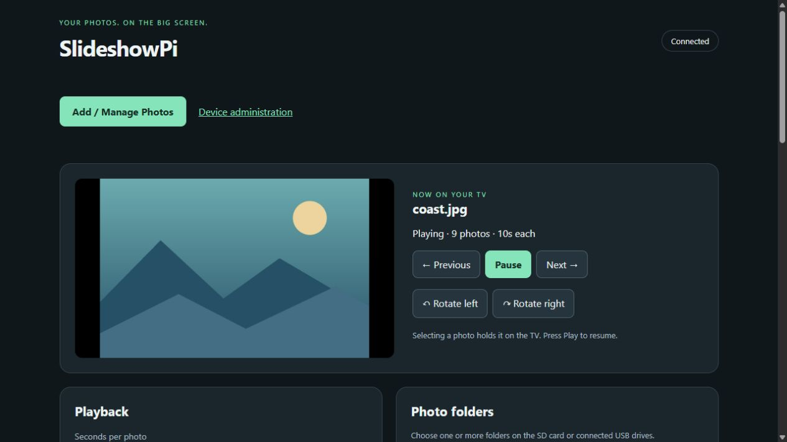
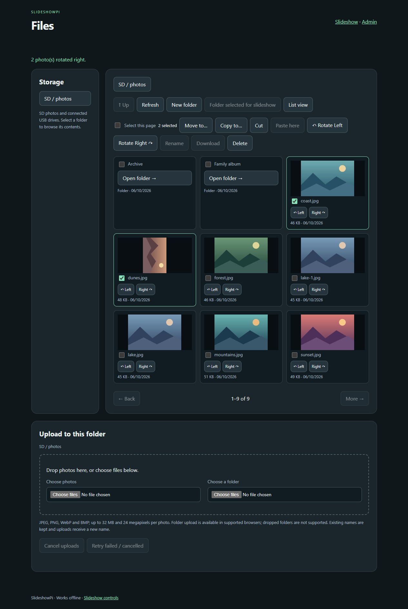
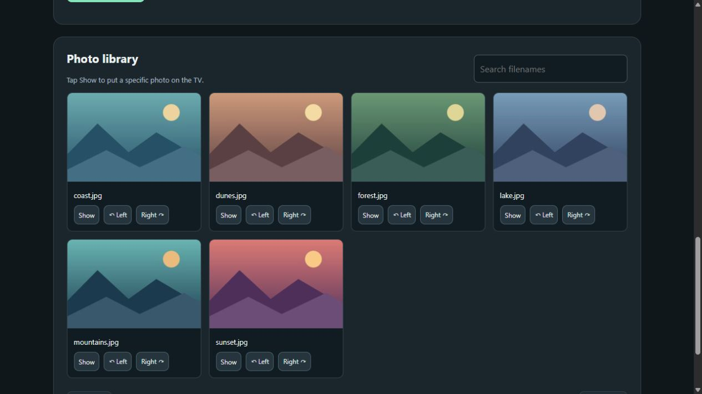
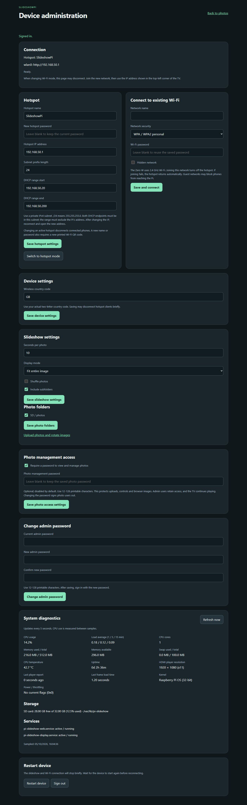
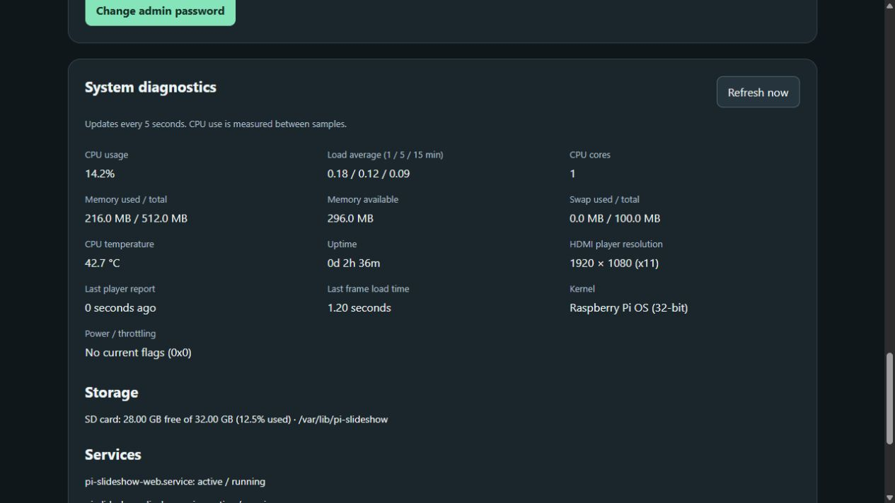
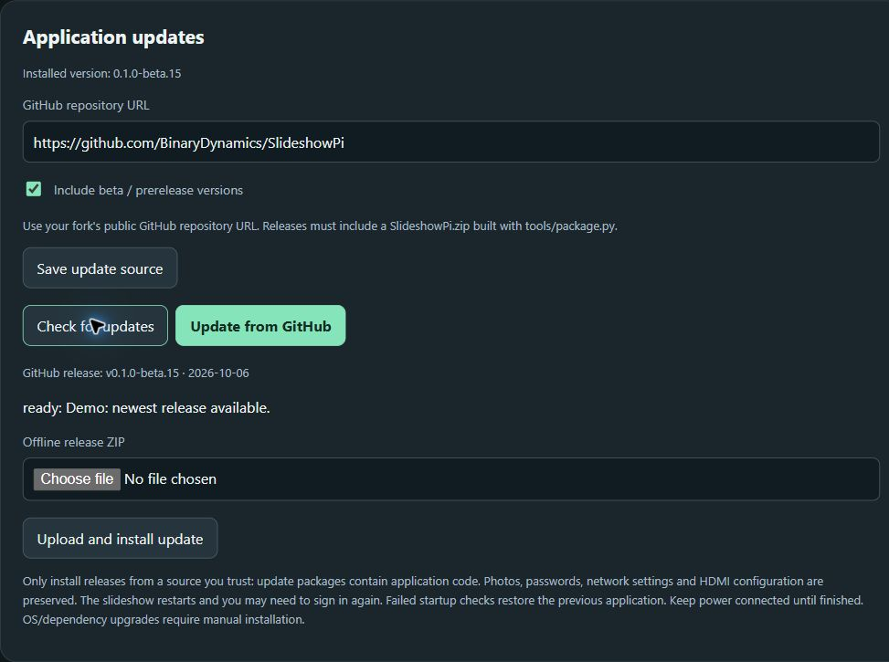
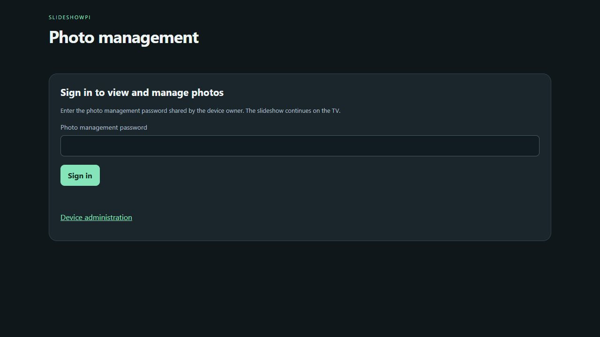

# SlideshowPi

Turn a Raspberry Pi Zero, Zero W or Zero 2 W into a small HDMI photo slideshow appliance. It starts playback automatically, accepts photo uploads over Wi-Fi, and works offline.

## Features

- Select multiple SD-card or USB folders, with optional subfolders.
- Upload JPEG, PNG, WebP or BMP; originals are preserved.
- Play, pause, previous/next, select a specific photo, rotate, shuffle, and set speed.
- File manager with folder navigation, grid/list views, multiple selection, move/copy, cut/paste, rename, download and confirmed deletion.
- Sequential upload queue with progress, cancel/retry, drag-and-drop photos and optional folder uploads.
- Fit the whole photo or fill the screen by cropping; automatic screen-size detection.
- Full HD rendering, Lanczos resizing, high-quality JPEG output and smooth scaling.
- Small network mode, Wi-Fi name and IP overlay in the top-left corner of the TV.
- Optional password protection for photo management and browser image access; TV playback continues.
- Password-protected `/admin`: restart, change hotspot details, join existing Wi-Fi, or return to hotspot mode.
- Diagnostics: CPU/load, memory/swap, temperature, uptime, storage, services, power flags, HDMI player resolution and frame-loading time.
- Automatic hotspot recovery if joining an existing network fails, or if its Wi-Fi address is lost for 90 seconds.
- Configure application credentials through one private text file: `slideshowpi.conf`.

## Screenshots

Examples from the actual web interface, using original sample illustrations and simulated diagnostics. No personal photos or real credentials are shown.

**Live slideshow controls** — preview the current photo, play/pause, move between photos and rotate in either direction.



**Files** — browse SD and USB folders, select multiple photos, move or copy them, and upload with a queue.



**Photo library** — select a specific photo and rotate each thumbnail clockwise or anticlockwise.



<details>
<summary>Administration and system diagnostics</summary>

**Administration** — hotspot name and IP/DHCP range, existing Wi-Fi, wireless country, playback options, folder selection and admin password changes.



**Diagnostics** — CPU, memory, temperature, screen resolution, storage and service status. These readings are examples, not performance measurements.



**Application updates** — update from a configurable public GitHub repository or upload a release ZIP offline.



**Optional photo sign-in** — protect family photos and controls with a separate password.



</details>

## Requirements

Use **Raspberry Pi OS Lite (32-bit), Trixie**, installed through Raspberry Pi Imager. The original **Pi Zero W v1.1** is ARMv6 and has 512 MB RAM; 64-bit images and generic ARMv7 Python wheels are unsuitable. This project installs Python/Xorg packages from Raspberry Pi OS repositories. Other Pi models and older Bookworm first-boot formats are not verified.

You need a microSD card (16 GB or larger recommended), a reliable power supply, and a mini-HDMI cable/adapter. For USB storage use an OTG adapter in the data port, or a powered hub for higher-power drives. The Zero W uses **2.4 GHz Wi-Fi**. Installation needs internet access; playback does not.

## Choose a setup method

Both methods install the same application and start the slideshow automatically after reboot.

| Method | Choose this when |
| --- | --- |
| [Prepare the SD card from Windows](#prepare-an-sd-card-from-windows) | You want to copy the application onto a freshly flashed card before the Pi's first boot. The Pi installs it automatically. |
| [Install directly on the Pi](#install-directly-on-the-pi) | Your Pi already boots and has internet access, and you prefer to run the installer over SSH or a local terminal. No automatic first-boot setup is needed. |

## Prepare an SD card from Windows

This workflow modifies an **already-flashed** card. It never formats the card. Use it before the Pi's first boot.

1. In Raspberry Pi Imager, select Zero W and flash compatible **Lite 32-bit**. Set a username/password, enable SSH, set your wireless country and an existing Wi-Fi network with internet access. Use `slideshowpi` as the hostname if desired. These OS/SSH settings are separate from the application's admin password.
2. Download/extract the project (or `SlideshowPi.zip`). The extracted folder must contain this README, `player.py`, `slideshow`, `deploy` and `tools`.
3. No application configuration is required. The helper creates complete defaults and unique Wi-Fi/admin passwords, saving a private **`slideshowpi.conf`** beside the application and on bootfs. For custom settings, optionally copy `slideshowpi.conf.example` to `slideshowpi.conf` and edit any values before preparation. Blank passwords are generated automatically. The wireless country is read from Imager’s boot command, falling back to `GB`; select your actual country in Imager or set it explicitly.
4. Install Python **3.11 or newer** on Windows, then run these commands in the extracted project folder:

   ```powershell
   py -m pip install PyYAML
   py tools/prepare_card.py --drive D:\
   ```

   Replace `D:\` with the card's **bootfs** drive letter. To use a configuration stored elsewhere, add `--config path/to/slideshowpi.conf`. Open your private `slideshowpi.conf` and save the generated passwords before booting the Pi. Re-running preparation reuses this file, keeping passwords stable. The helper validates the configuration, copies the application and text file to bootfs, and adds the first-boot command to Imager's cloud-init `user-data`. Existing OS user, SSH and provisioning-network settings are preserved; the original user-data is backed up. It checks file readback. A card without Imager-generated `user-data` and `network-config` is rejected.
5. Safely eject the card, insert it into the Pi, connect HDMI and power it on with the provisioning Wi-Fi available. Keep power connected while packages install. Installation can take **10-30 minutes** on a Zero W. The installer retries failed downloads and then reboots automatically.
6. In hotspot mode, join your configured hotspot, choose to stay connected despite **No internet**, and open **http://192.168.50.1**. The captive-portal prompt is a convenience and depends on the phone; opening the URL manually always remains available. In client mode, connect your phone to the same network and open the **IP shown on the TV**.
7. Upload photos, select folders, and choose playback settings. Open **`/admin`** using the admin password in your private text file. All device/network settings, the admin password, playback options and photo-folder selection can be changed there.

The text file is consumed and removed from bootfs after successful setup. Keep your own secure copy outside Git for recovery. If setup fails, bootfs `pi-slideshow-status.txt` or `journalctl -u pi-slideshow-install -b` provides status. Do not post your real configuration, Imager files, photos or credentials in public issues.

## Install directly on the Pi

Use **Raspberry Pi OS Lite (32-bit), Trixie** with internet access. When flashing a new card, use Raspberry Pi Imager to set your OS username/password, enable SSH, choose your wireless country, and configure an existing Wi-Fi network. Boot the Pi normally and connect over SSH or open a local terminal.

1. Download the project and run the installer:

   ```bash
   sudo apt update
   sudo apt install -y git
   git clone https://github.com/BinaryDynamics/SlideshowPi.git
   cd SlideshowPi
   sudo env COUNTRY=GB bash deploy/install.sh
   ```

   Replace `GB` with your actual two-letter wireless country code. The installer installs packages and system services, creates the default `SlideshowPi` hotspot and generates separate Wi-Fi and admin passwords. Keep the Pi powered on until installation finishes.

2. Before rebooting, display and save the generated credentials somewhere private:

   ```bash
   sudo cat /etc/pi-slideshow/credentials.txt
   sudo cat /etc/pi-slideshow/admin-password.txt
   ```

   The first file contains the hotspot name, Wi-Fi password and web address; the second contains the admin password. Do not post these files in public issues.

3. Reboot:

   ```bash
   sudo reboot
   ```

4. The Pi starts the slideshow and switches from the existing Wi-Fi to its **SlideshowPi** hotspot. This disconnects an SSH session using the previous Wi-Fi. Join the hotspot with the generated Wi-Fi password, choose to stay connected despite **No internet**, and open **http://192.168.50.1**.
5. Open **http://192.168.50.1/admin**, sign in using the generated admin password, and customise network settings, passwords, playback and photo folders. You can also switch back to an existing Wi-Fi network there. Upload photos using the main page.

The Windows preparation tool and cloud-init first-boot hook are not used by this method. There is no need to create an application configuration file for the default installation; you can customise it through `/admin` afterwards. The installer enables automatic slideshow startup for subsequent boots.

## Configuration reference

See [slideshowpi.conf.example](slideshowpi.conf.example) for the complete format. Omitted hotspot IP settings use the defaults below. Use a private subnet within `10.0.0.0/8`, `172.16.0.0/12` or `192.168.0.0/16`. The Pi and both DHCP endpoints must be usable addresses in the same subnet. The inclusive DHCP range must exclude the Pi's address. For example, set `ip_address = "192.168.60.1"`, `prefix_length = 24`, `dhcp_start = "192.168.60.20"`, and `dhcp_end = "192.168.60.200"` together.

| Setting | Meaning |
| --- | --- |
| `device.country` | Uppercase country code; blank/omitted uses Imager during preparation, fallback `GB` |
| `hotspot.ssid` | Default `SlideshowPi`; 1-32 UTF-8 bytes; spaces supported |
| `hotspot.password` | Blank/omitted generates a unique password; custom values: 8-63 printable ASCII characters |
| `hotspot.ip_address` | Pi's hotspot IPv4 address; default `192.168.50.1` |
| `hotspot.prefix_length` | Subnet prefix, 8-30; default `24` (`255.255.255.0`) |
| `hotspot.dhcp_start` | First address offered to phones; default `192.168.50.20` |
| `hotspot.dhcp_end` | Last address offered to phones; default `192.168.50.200` |
| `photo_access.enabled` | Default `false`; require a password to view and manage photos |
| `photo_access.password` | Custom 12-128 printable characters; blank generates a unique password when enabled during card preparation |
| `admin.password` | Blank/omitted generates a separate unique password; custom values: 12-128 printable ASCII characters |
| `network.mode` | Default `hotspot`; `client` requires actual existing Wi-Fi credentials |
| `home_wifi.ssid` | Saved existing network, optional in hotspot mode |
| `home_wifi.password` | 8-63 character passphrase or 64 hexadecimal PSK for personal WPA/WPA2 |
| `home_wifi.security` | `wpa` or `open` |
| `home_wifi.hidden` | Default `false`; `true` for a hidden network |
| `slideshow.seconds` | Default `10`; 1-3600 seconds per photo |
| `slideshow.shuffle` | Default `false` |
| `slideshow.recursive` | Default `true`; include subfolders |
| `slideshow.fit` | Default `contain` (fit entire image); `cover` fills and crops |

The initial photo folder is SD storage at `/var/lib/pi-slideshow/photos`, playback starts automatically, and HDMI resolution is detected automatically. Existing installations keep playback settings when the supplied file omits `[slideshow]`; an explicit section applies those values while preserving folder selection and per-photo rotations. Existing Wi-Fi uses DHCP. Enterprise authentication, browser-login guest networks and WPA3-only networks are not supported by this form. Some guest networks isolate clients, which prevents phone-to-Pi access. Hotspot and client modes are mutually exclusive on this appliance.

## Admin and networking

Open `http://<current-IP>/admin`. In hotspot mode the IP defaults to `192.168.50.1` or uses your configured `hotspot.ip_address`; in client mode it is assigned by the router and shown on the TV. A small overlay in the upper-left corner shows the network mode and Wi-Fi name above the current IP address, updating even while playback is paused. The web server listens in both modes without restarting when the address changes. `slideshowpi.local` may also work if your OS/network supplies mDNS; use the numeric IP if it does not.

- **Device settings:** change the wireless country; hotspot clients may briefly disconnect. OS login, SSH and hostname remain Raspberry Pi Imager settings.
- **Photo management access:** optional, off by default. Enable it under `/admin` and set a separate 12-128 character password. Blank retains an existing photo password; enabling for the first time requires a password. Photo sessions last one hour; changing the password invalidates them. This protects thumbnails, image downloads, uploads and slideshow controls. Signed-in admins retain access, and HDMI playback continues through its separate loopback-only connection. Disabling protection allows anyone on the hotspot/LAN to view and manage photos again. If the admin service is unavailable, browser photo access is temporarily denied.
- **Admin password:** supply the current password and a new 12-128 character password. Sign in again after saving; existing admin sessions are invalidated. Keep your private recovery copy up to date.
- **Slideshow settings:** change speed, fit, shuffle, subfolder scanning and photo-folder selection. Upload and rotation controls are available on the photo page.
- **Restart:** confirms the action, responds to the browser, then restarts the Pi.
- **Hotspot settings:** save the name, password, Pi IP address, subnet prefix and DHCP range. Changing IP settings restarts the hotspot and DHCP; reconnect and open the new IP address. A blank password retains the existing one. Changing an active hotspot disconnects phones, and any printed Wi-Fi QR code must be regenerated.
- **Existing Wi-Fi:** enter its name/security/password and select Save and connect. The hotspot switches off. A blank password reuses the saved password only for the same network. Join that network on your phone and use the TV's new IP.
- **Switch to hotspot:** leaves the existing network and restores the hotspot at its configured IP address.
- **Recovery:** a failed join restores hotspot mode. Losing the client's Wi-Fi IPv4 address for 90 seconds also restores hotspot mode. This does not detect guest-network isolation or an internet outage while Wi-Fi remains connected.
- **Diagnostics:** refreshes every 5 seconds. CPU needs two samples. Power flags distinguish current conditions from events since boot. The HDMI player reports its canvas size and a heartbeat; unavailable readings are labelled accordingly. AP/DNS services being inactive in client mode is expected.

Admin sessions last one hour and are invalidated when the web server restarts. Your slideshow continues while network modes change. A reboot uses the saved mode.

To reset settings without SSH, shut down and copy a completed `slideshowpi.conf` to bootfs. The next normal boot applies it and removes the file. This reapplies all application credentials and network settings in the file. Invalid input retains the working settings. From SSH, the recovery admin password is root-readable:

```sh
sudo cat /etc/pi-slideshow/admin-password.txt
```

## Update an existing installation from an SD card

**Do not run the fresh-install helper on a previously booted Pi.** Shut down the Pi cleanly, insert the card into the computer, and use:

```powershell
py tools/prepare_admin_update.py --drive D:\ --config slideshowpi.conf
```

For a device that has already applied an admin update, omit `--config` to keep all current passwords, network and playback settings. Supply it only when you also want to apply the settings from that file.

This stages an application update on bootfs and arms a one-time maintenance boot. It backs up replaced application/systemd files on the Pi, verifies the payload, preserves uploaded photos and playback settings, and restores the original boot command before applying changes. An explicitly supplied `[slideshow]` section overrides its playback options; omitting it preserves existing choices. It preserves Xorg configuration and existing display-service overrides, including working gamma fixes. The admin service applies your text configuration on the subsequent normal boot. Start in hotspot mode if you want to preserve easy local access.

After staging, safely eject and boot the Pi. Allow the maintenance update and one automatic reboot. Check `pi-slideshow-admin-update.txt` on bootfs if the update fails. A failed update restores normal boot rather than looping in maintenance.

## Photos and display

SD uploads live under `/var/lib/pi-slideshow/photos`. USB filesystems with UUIDs mount under `/media/slideshow/<UUID>`. FAT32, exFAT, NTFS and ext2/3/4 are supported. Linux filesystems retain their own permissions; uploads require directories writable by the `slideshow` account. Already-mounted drives and encrypted volumes are left alone. Disconnecting a selected drive retains its selection for the next insertion.

The app allows at most 32 MB and 24 megapixels per upload and limits the playlist to 10,000 photos. Folder lists have a 3,000-folder limit per storage root. Duplicate upload filenames get a new suffix. Rotation affects display metadata, not the original image. Moving a photo changes its identity. Folder/rotation/speed settings persist, while a paused slideshow resumes playing after reboot.

Full HD is rendered natively. Larger screens keep their aspect ratio but frames are bounded to 2.07 megapixels and a 1920-pixel edge for memory use. The detected display resolution is taken at player startup: restart the display service after manually changing HDMI modes. A very short slide interval may be slower than a large image's decode time on the original Zero W. No animated transitions or video playback are included.

Finish uploads before removing storage. To unplug a USB drive, unmount it over SSH and promptly remove it; the automounter can remount a connected drive. Shut down with `sudo poweroff` before unplugging the Pi's power.

## Troubleshooting

Start with `/admin` diagnostics, then use SSH if needed:

```sh
systemctl status pi-slideshow-admin pi-slideshow-web pi-slideshow-display
journalctl -u pi-slideshow-admin -u pi-slideshow-web -u pi-slideshow-display -b --no-pager
journalctl -b _COMM=python3 --no-pager -n 100
```

- **No page:** use the exact `http://` address shown on the TV. In hotspot mode stay connected despite no internet. A VPN/private DNS setting can interfere with captive-portal detection.
- **No hotspot:** inspect `pi-slideshow-admin`, `pi-slideshow-ap` and `pi-slideshow-dns`; check wireless country and power.
- **Black HDMI screen with a working web page:** distinguish image loading from physical display output. `/var/log/Xorg.0.log` contains Xorg errors. A known modesetting gamma issue can be worked around with `Option "UseGammaLUT" "false"` in the Xorg Device section; the tested configuration is provided in `deploy/20-slideshowpi-rendering.conf`. Restart the display service after installation of that file. Existing SD updates preserve such fixes.
- **Player logs missing from `journalctl -u`:** if using a PAM login session, inspect `loginctl list-sessions` and `journalctl -b _SYSTEMD_SESSION=<session-id>`.
- **Low voltage or throttling:** check the supply/cable and ventilation. Historic flags remain until reboot.
- **Insufficient space:** delete or move photos using SSH; the uploader reserves 64 MB free space.

Internal paths and service names retain `pi-slideshow` for compatibility with existing installations. See [SECURITY.md](SECURITY.md) for access boundaries and credential handling.

## Development and releases

Python 3.11+ is required. On a computer:

```sh
python -m venv .venv
# Activate the virtual environment for your platform.
python -m pip install -r requirements-dev.txt
python -m pytest -q
python tools/package.py
```

`dist/SlideshowPi.zip` is an allowlisted source/provisioning archive. It contains no real credentials, generated cards, photos, attachments or local environment. Do not add any of those to Git. Local UI preview can be started with `SLIDESHOW_DATA` and `SLIDESHOW_USB` pointed to disposable folders, then `python run.py --host 127.0.0.1 --port 8080`; hardware administration is unavailable outside the Pi unless using a test broker.

Automated tests cover playback, uploads, storage boundaries, CSRF/admin authentication, actual-LAN host checks, configuration parsing, root-operation allowlisting, failed Wi-Fi recovery and SD-update preservation. Tests cannot establish real Wi-Fi association, DHCP, boot, HDMI or Pi performance. Slideshow display and quality have been exercised on an original Zero W; the new administration/network-switching release still requires hardware verification.

Licensed under [MIT](LICENSE). Contributions are welcome; include reproduction steps and tests, and remove credentials/photos/private network details from reports.

### TV remote controls (HDMI-CEC)

CEC is enabled by default on both supported Pi Zero models. Enable HDMI-CEC in your TV settings (sometimes called Anynet+, Simplink, BRAVIA Sync or VIERA Link), and select the Pi's HDMI input. The HDMI cable and any adapters must carry CEC. TVs differ in which remote buttons they forward.

| Remote button | Slideshow action |
| --- | --- |
| Left, Previous or Rewind | Previous photo |
| Right, Next or Fast-forward | Next photo |
| OK / Select / Enter | Toggle play and pause |
| Play | Resume slideshow |
| Pause or Stop | Pause on the current photo |

Navigation preserves the current play/pause state. Holding OK toggles once per press; held navigation repeats at a limited rate. CEC controls work even when browser photo management requires a password. They cannot change administration settings. Power and volume buttons retain their TV behavior; SlideshowPi sends no TV wake, standby or input-switch commands.

In `/admin`, use **TV remote control (HDMI-CEC)** to disable or re-enable controls without restarting. The same setting is available in `slideshowpi.conf`:

```toml
[cec]
enabled = true
```

Admin shows whether CEC is ready, waiting for HDMI, or unavailable. Missing or unsupported CEC does not interrupt the slideshow; the device retries automatically. This uses the Linux `/dev/cec*` interface and needs no extra packages. Another application using the adapter may prevent CEC control. Keep the normal KMS driver enabled and avoid configuring another CEC controller alongside SlideshowPi. Automated tests cover the input and access rules; TV interoperability still requires testing on your hardware.

### Deleting photos

Use **Delete** below a photo in the web photo library, then confirm its filename. This permanently removes the original from its SD or USB folder; it cannot be undone. Read-only or disconnected storage is rejected. Browser password protection, when enabled, also protects deletion. If the current photo is deleted, the TV moves to the next available photo while keeping its play/pause state; deleting the last photo shows the empty slideshow screen. Refresh the library if a file has changed since the thumbnail loaded.

### Files and folder management

Choose the prominent **Add / Manage Photos** button at the top of the slideshow page (or visit `/files`). Uploads and folder creation live on the Files page; the slideshow page keeps its live controls, settings, folder selection and photo library. The sidebar lists SD photo storage and mounted USB drives. Open folders and use breadcrumbs or Up to navigate. Switch between thumbnail grid and list view. Check individual entries, Shift-click a range on a computer, or select the current page (100 entries maximum per operation).

- **Move to… / Copy to…**: browse to a destination, then choose Keep both or Skip for name conflicts. Keep both adds a number; existing entries are never silently overwritten. Folders are copied as a whole rather than merged.
- **Cut / Paste here**: select entries, choose Cut, navigate to a folder, then Paste here. This clipboard stays in the current browser tab; paste keeps both on conflicts.
- **New folder / Rename / Delete**: manage photos and photo folders. Deletion asks for confirmation and permanently removes the original files. Storage roots cannot be moved or deleted. Folders containing hidden, linked or non-photo entries are refused to prevent deleting unrelated data.
- **Rotate Left / Rotate Right**: use the buttons on a photo thumbnail, or select several photos and use the toolbar. Rotations are saved as display settings, including for photos outside selected slideshow folders; originals remain unchanged.
- **Download**: select a single photo to download its original. Rotation remains a display setting; the downloaded file is unchanged.
- **Use this folder in slideshow**: add the open folder to playback without replacing the other selected folders. Existing slideshow settings and image controls remain on the Slideshow page.
- **Upload**: choose multiple photos or drop files into the upload area. Supported browsers can use Choose a folder to preserve its subfolder structure. Dropped folders are not supported. The queue sends one photo at a time, shows progress/errors, and offers Cancel and Retry failed / cancelled. The destination is captured when files are queued, so browsing elsewhere does not redirect pending uploads. Cancelling interrupts browser uploads; a file already accepted by the server may still appear. Refresh before retrying to avoid duplicate uploads.

Moves and renames preserve saved rotations and update selected slideshow folders. Same-filesystem moves use a rename. Copies and moves between filesystems verify file contents with SHA-256 before completing; a cross-drive move removes originals only after verification. Missing, changed, linked or read-only entries are rejected. Operations run in the background; progress appears below the upload section and survives closing/reopening the page while the server remains running. Keep USB drives connected and the Pi powered until an operation finishes. Jobs are not resumed after a reboot or server restart; refresh storage after an interruption. A batch can finish partially; its results identify failed/skipped entries.

The browser photo password, when enabled, protects the file manager and its APIs. Only photo storage is accessible; system/configuration files are outside its scope. Folder contents are loaded in pages, thumbnail requests are lazy, and transfers use bounded memory to suit the original Pi Zero W. Folder operations are limited to 20,000 entries; upload queues to 1,000 photos. Uploads retain the existing 32 MB / 24 megapixel limit. Conflicts currently support Keep both and Skip; replacing originals and drag-and-drop moves are not included.

### Automatic offline / No Wi-Fi operation

A Pi Zero without a Wi-Fi chip now boots the slideshow normally after installation. The TV shows **No Wi-Fi / Offline slideshow** when there is no network connection. HDMI playback, local SD/USB photos and CEC controls continue working; missing Wi-Fi does not stop the admin broker or playback clock.

Network adapters are checked every five seconds. Connecting a Linux-supported USB Wi-Fi adapter starts the saved hotspot or home Wi-Fi mode automatically, including adapters whose interface name differs from `wlan0`. Hotspot use requires AP support in the adapter/driver. Connecting USB Ethernet enables networking through NetworkManager/DHCP; once an IPv4 address is assigned, the TV shows it and the same photo/admin pages are accessible there. An existing wired connection is retained. Unplugging adapters returns to No Wi-Fi when no wired connection remains. Network failures are retried, and saved credentials/preferences are retained when hardware is missing. The Admin connection section lists detected adapters, cable state and current addresses. A USB hub may be needed to connect storage and a network adapter together on a Zero.

The fresh installer still needs internet access to download packages, through Wi-Fi or Ethernet. Install while connected, or use an already installed card; the staged SD updates require no internet. No USB networking driver or DHCP server is installed on your computer automatically. USB gadget networking must already be configured; a supported USB Ethernet adapter and normal DHCP network are the straightforward wired option. Adapter hotplug and no-Wi-Fi startup are covered by automated tests; physical adapter compatibility and DHCP still require hardware verification.

### Default photo sources

New installations automatically include all supported photos in `/var/lib/pi-slideshow/photos` on the SD card and all connected, mounted USB storage under `/media/slideshow`, including subfolders with the default recursive setting. Newly mounted drives join the playlist on the next storage scan (normally within 15 seconds); removed drives leave it. Supported formats and the existing 10,000-image playlist limit still apply.

The slideshow and Admin folder sections offer **Automatically include all SD and USB photos**. Leave it enabled for automatic selection, or turn it off and choose specific folders. Existing installations with explicitly saved folder selections keep those selections during an upgrade; enable the checkbox to opt into the new behavior. In the setup text file, the setting is:

```toml
[slideshow]
auto_folders = true
recursive = true
```

Preloaded SD images belong in the application photo folder, not the boot partition. USB photos can be copied onto a supported USB drive from Windows before connecting it to the Pi.

### Hotspot fallback troubleshooting

A failed home-network join restores the hotspot when Wi-Fi hardware is present. If a connected home network disappears, the monitor checks both Wi-Fi link state and IPv4 addressing; a stale DHCP address does not prevent fallback after the 90-second grace period. No Wi-Fi hardware still uses offline mode.

Releases v0.1.0-beta.11 and v0.1.0-beta.12 contained a hotspot startup script with Windows CRLF line endings in the ZIP/Windows SD payload. Bash can reject this with an `invalid option name` error, preventing the hotspot from starting. Update to v0.1.0-beta.13 or later. New installation packages and SD preparation/update tools normalize shell scripts to Unix LF line endings. The SD updater also repairs verified older CRLF shell payloads when deploying them. Photos and network credentials are preserved.

### Shuffle without repeats

Shuffle uses a randomized playlist rather than choosing an independent random photo at every transition. Each available photo appears once per automatic cycle. The next cycle is reshuffled and, with at least two photos, starts with a different photo from the one that just finished. Previous follows actual playback history; Next retraces that history before continuing the remaining sequence. History is limited to the last 20,000 displays.

Uploads and newly mounted USB photos join the remaining shuffled sequence. Rescanning unchanged storage does not restart the cycle. Deleted or disconnected photos leave the sequence and history; moves/renames preserve their position. Manually choosing Show can intentionally repeat a photo and pauses playback; if it was still pending, it is consumed from this cycle. Restarting the app creates a fresh cycle. Distinct files containing the same picture are still treated as distinct photos.

### Updating from Admin (online or offline)

Install update support once using this release's SD update or direct Pi installer. Older versions without **Application updates** on `/admin` cannot receive their first web update.

1. Sign in to `/admin` and find **Application updates**. The installed version and update status appear here.
2. For an online update, connect the Pi to a network with internet access. Choose **Check for updates**, then **Update from GitHub**. A phone having mobile data while connected to the Pi hotspot does not give the Pi internet access automatically.
3. For an offline update, download **SlideshowPi.zip** from the chosen repository's release assets on another device. Connect to the Pi over its hotspot or normal network, choose the ZIP under **Offline release ZIP**, and select **Upload and install update**. The Pi needs no internet for this method.
4. Keep power and storage connected. The slideshow and web services restart during installation. Reload the page and sign in again to see the result. A successful update keeps the previous app copy for rollback; failed startup checks automatically restore it. Interrupted activation is recovered by a boot service before the slideshow services start.

The default source is `https://github.com/BinaryDynamics/SlideshowPi`. To use a fork, enter its public GitHub repository URL and save it in Admin. The same settings are available in your private setup file:

```toml
[updates]
repository = "https://github.com/BinaryDynamics/SlideshowPi"
include_prereleases = true
```

Prereleases are included by default because current SlideshowPi releases are betas. If disabled, only stable releases are considered. The updater chooses the most recently published eligible release among the latest 100 releases. It downloads that release's **SlideshowPi.zip** asset; GitHub's automatically generated source-code ZIP is not an update package. Private repositories/GitHub tokens are not supported. Check failures or interrupted downloads leave the application unchanged. Reinstalling the same release is allowed.

Fork maintainers: update `VERSION` and run `python tools/package.py`, then attach `dist/SlideshowPi.zip` to a published GitHub release. The packager generates `release.json` with the version, update format, dependency-set contract and SHA-256 file checksums. Older ZIPs without this manifest are rejected. Update uploads are limited to 64 MB, unpacked contents to 128 MB, individual entries to 8 MB and packages to 2,000 entries. At least 192 MB of free staging space is required. ZIP paths, links, duplicates, required files, checksums and Python syntax are checked before activation. An unprivileged import check and service/HTTP startup check run before accepting the update. The private health endpoint waits for the HDMI player to report successful initialization and for the admin broker to respond; it does not expose photo metadata to browsers.

Only install code from repositories and packages you trust. Manifest checks detect corruption and unsafe archive structure; they are not a publisher signature. The repository source determines the application code that will run, including the root administration broker. GitHub downloads use HTTPS and verify the asset digest when supplied by GitHub.

Application updates preserve `/var/lib/pi-slideshow` photos/settings, mounted USB contents, `/etc/pi-slideshow` credentials/network configuration and existing systemd/Xorg/HDMI settings. They do not run package installers or update Raspberry Pi OS, dependencies or installed systemd unit definitions. Changes requiring those must use the direct installer or an appropriate SD maintenance update; keep `dependency_set = 1` only while the runtime dependency contract is unchanged. Update staging/status/rollback data live in `/var/lib/pi-slideshow-updates`, outside photo storage. Only the most recent successful rollback copy is retained. Active file-management jobs block update installation, and photo/storage mutations are paused while an update runs. Files already being uploaded when an update is requested may still be interrupted; finish uploads before updating.

If troubleshooting is needed, inspect `sudo journalctl -u pi-slideshow-update -u pi-slideshow-update-recovery -b`. Automatic tests cover package validation and mocked activation/rollback; real Pi service restarts and power-interruption recovery still need hardware verification.
